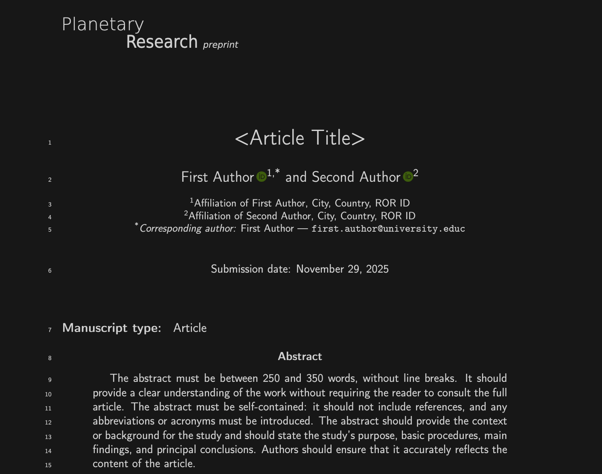

# Planetary Research — Journal Templates

Official LaTeX and docx/odt templates for submissions to *Planetary Research*.

## Repository layout

- `planetary.cls` — journal class.
- `manuscript.tex` — main manuscript template that uses `biblatex`/`biber`.
- `supplmentary-materials.tex` — supplementary material template matching the class defaults.
- `references.bib` — sample bibliography.
- Assets: `journal_logo.pdf`, `frontpage.png`, `cc.png`, `by.png`.
- Figures: `planet.png`
- `PR_Article.docx` — docx/odt template for all manuscript types except letters.
- `PR_Letter.docx` — docx/odt template for letters.
- `PR_supplementary_materials.docx` — docx/odt template for supplementary materials.

## docx/odt instructions

Download and edit the file `PR_Article.docx` or `PR_Letter.docx`. Before submitting the manuscript, be sure to convert the file to PDF.

## LaTeX instructions

Place the files `planetary.cls` and `manuscript.tex` in the same folder and then edit the file `manuscript.tex`.

The default options for the LaTeX class are **review** (line-numbered, 12pt) and **article** (research article). Use **final** for a preprint-ready layout (11pt, right-aligned title/authors, adjusted margins). For other manuscript types, see below.

Screenshot of the compiled front page of the LaTeX submission file `submission-BIBLATEX.tex`:

### Build commands
- Full cycle (recommended):  
  `pdflatex manuscript.tex && biber manuscript && pdflatex manuscript.tex && pdflatex manuscript.tex`
- Supplementary material: `pdflatex supplementary-materials.tex`
- If available, `latexmk -pdf manuscript.tex` is fine; ensure it calls `biber`.

### Class options - preview mode
- **review**: line numbers enabled; 2.5 cm margins.
- **final**: left margin widened to 3.8 cm; title/authors flushed right; floats and captions right-aligned.

### Class options - manuscript type
- **article**: Research article
- **reviewarticle**: Review article
- **letter**: Letter
- **numericalcode**: Numerical code
- **dataset**: Datasets
- **missions**: Missions and instrumentation
- **introduction**: Introduction to a special issue
- **editorial**: Editorial
- **commentary**: Commentary

### Tips
- Keep logo filenames unchanged; they are referenced by the class (`journal_logo`).
- Avoid defining ad-hoc macros in manuscripts. Make a pull request to modify the class if a feature is needed.
- Use `\upmu` for an upright micro sign in units, for example `3~\upmu m` instead of `$\mu$m`.
- Treat warnings as failures to fix before submission.

# License and support
Released under the MIT License unless stated otherwise. For help, contact `tech@planetary-research.org`.
